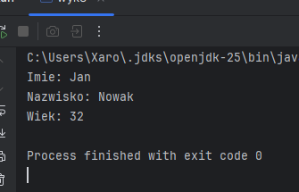

## I. Dokumentacja do wykładu. nr 3 - "Klasy i Metody"
## II. Mateusz Malewski - grupa 1, semestr III
## III. Przedmiot - "Programowanie obiektowe"

## IV. Opis zadania do realizacji
Do zrealizowania były następujące zadania:  
  
  - Czym różni sie klasa od obiektu?
  - Z czego składają sie klasy?
  - Jak utworzyć nowy obiekt klasy?
  - Czy poniższa klasa jest prawidłowa? 
```java
public class Pytanie {
    public static void main(String[] args) {
        System.out.println( "Witaj!" );
    }
}
```
  - Co zostanie wypisane na ekran?
```java
public class Punkt {
    private int x , y ;
    
    public void ustawX( int wartoscX) {
        x = wartoscX;
    }
    
    public void ustawY( int wartoscY) {
        y = wartoscY;
    }
    
    public String toString() {
        return "X, Y: " + x + ", " + y ;
    }
    
    public static void main(String[] args) {
        Punkt a = new Punkt();
        Punkt b = new Punkt();
        a.ustawX( 10 );
        a.ustawY( 20 );
        b.ustawX( 0 );
        b.ustawY( 5 );
        System.out.println(a);
        System.out.println(b);
    }
}
```
  - Napisz klase która będzie zawierała:
    - Trzy pola: ```wiek```, ```imie```, ```nazwisko```. użyj odpowiednich typów.
    - Trzy metody, w których będziesz ustawiał wartości pól klasy: `ustawWiek`, `ustawImie`,
      `ustawNazwisko`. Argumenty tych metod powinny nazywać się **wartoscWieku** ,
      **imieOsoby** , **nazwiskoOsoby**.
    - Metodę `toString`, która będzie zwracała informacje o imieniu, nazwisko, oraz wieku
      osoby.
    - Metodę main, w której utworzysz jeden obiekt klasy Osoba i nadasz mu wartości
      za pomocą metod `ustawWiek`, `ustawImie`, oraz `ustawNazwisko`, a następnie, za pomocą
      `System.out.println`, wypiszesz utworzony obiekt typu `Osoba` na ekran.


## V. Technologie wykorzystane w zadaniu
  - Java  

## VI. Realizacja zadania
<br>

#### 1. Odpowiedzi na pytania
1. Klase można traktować jako schemat który może być wykorzystywany przez obiekt, a obiekt jest "produktem" stworzonym na podstawie klasy.
2. Z pól, czyli zmiennych należących do klasy, oraz Metod, czyli definicji operacji, które klasa udostępnia reszcie programu. 
3. Poprzez użycie słowa kluczowego **new**, np. ```klasa obiekt1 = new klasa()```
4. Tak, kod zawiera publiczną definicje klasy ```Pytanie```, oraz metode ```Main```
5. ```shell 
    X, Y: 10, 20 
    X, Y: 0, 5 

#### 2. Kod Javy | Zadanie 6
W zadaniu wykorzystano klase Osoba, trzy pola na `Imie`, `Nazwisko` i `Wiek`, trzy metody na wypełnienie tych pól, oraz metode `toString`.
Dodatkowo został wykorzystany ```String.format()``` do wypisania zmiennych w tekscie bez rozbijania go na więcej niż jeden cudzysłów. <br>
Kod wykorzystany do rozwiązania zadania:  

```java
public class wyk3 {
    public static class Osoba {
        private int wiek;
        private String imie, nazwisko;

        public void ustawWiek(int newWiek) { wiek = newWiek; }
        public void ustawImie(String newImie) { imie = newImie; }
        public void ustawNazwisko(String newNazwisko) { nazwisko = newNazwisko; }

        public String toString() {
            return String.format("Imie: %s%nNazwisko: %s%nWiek: %d", imie, nazwisko, wiek);
        }
    }

    public static void main(String[] args) {
        Osoba koles = new Osoba();
        koles.ustawImie("Jan");
        koles.ustawNazwisko("Nowak");
        koles.ustawWiek(32);
        System.out.println(koles);

    }
}
```

#### 3. Zrzuty ekranu pokazujące wynik działania aplikacji/skryptu:  


